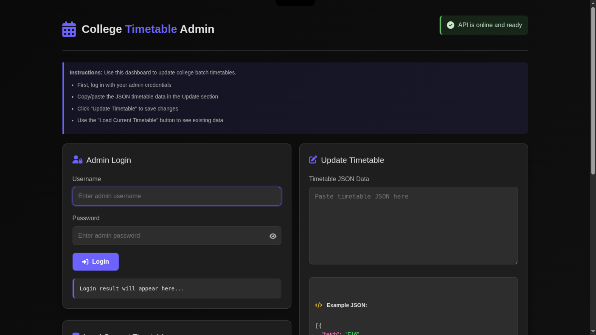

# Timetable Admin Dashboard

A clean, dark-themed web interface for managing college batch timetables. Admins can update schedules via JSON while students view their weekly class schedules.



## Features

- **Admin Panel**:
  - Secure login system
  - JSON-based timetable management
  - Real-time updates

- **Student View**:
  - Clean timetable display
  - Batch-specific schedules

## Tech Stack

- **Frontend**: HTML5, CSS3, JavaScript
- **Backend**: Node.js/Express (hosted on Render)
- **Database**: MongoDB

## Setup

1. Clone the repo:
   ```bash
   git clone https://github.com/AmanVerma1067/TTadmin
   ```

2. Open `index.html` in any modern browser

## API Endpoints

```http
GET /api/timetable
POST /admin/login
POST /admin/update
```

## JSON Structure

```json
{
  "batch": "E15",
  "Monday": [
    {
      "time": "9:00 AM",
      "subject": "Mathematics",
      "room": "B-201",
      "teacher": "Dr. Smith"
    }
  ],
  // ...other days
}
```

## License

MIT © [Aman Verma]
